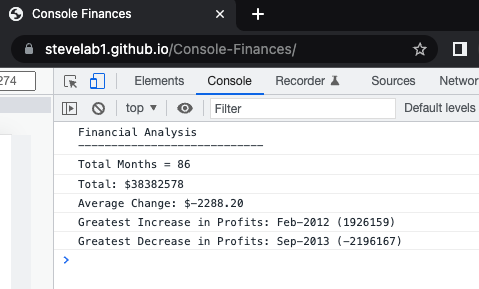

# Console-Finances

## Overview

This project contains JavaScript code for analyzing the financial records of a company based on a provided financial dataset and logging to the browser console.

## Functionality

Given a dataset composed of arrays with two fields, Date and Profit/Losses.

The code analyzes the records to calculate each of the following:

- The total number of months included in the dataset.

- The net total amount of Profit/Losses over the entire period.

- The average of the changes in Profit/Losses over the entire period.
- The greatest increase in profits (date and amount) over the entire period.

- The greatest decrease in losses (date and amount) over the entire period.

## Appearance

When you open your code in the browser console your resulting analysis should look similar to the following screenshot:

---
